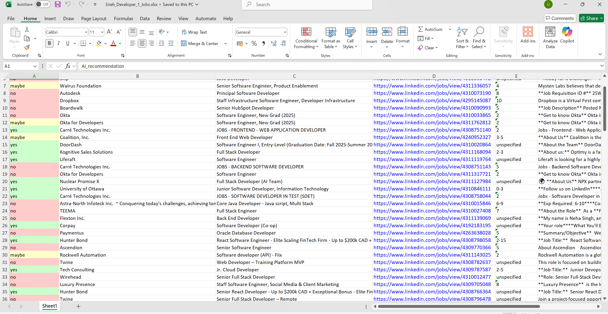

# Job Scraper with AI Filtering

This project enables you to scrape job postings from LinkedIn, Glassdoor, Indeed, and ZipRecruiter. The job descriptions are sent to an AI LLM model to determine their suitability for you and organize all jobs for you in Excel file.

## Features

- **Multi-platform Job Scraping:** Automatically scrape jobs from LinkedIn, Glassdoor, Indeed, and ZipRecruiter.
- **AI-based Filtering:** The scraped job descriptions are sent to an AI model for evaluation based on your predefined criteria.
- **Duplicate Prevention:** Built-in mechanism to prevent sending the same job to the AI more than once.
- **Simple and Adjustable:** The code is straightforward and easy to modify to suit your needs.

## Installation

1. **Install the required packages:**
    ```bash
    pip install -r requirements.txt
   tested with python 3.12
2. **Download Ollama.**
    - Using link [here](https://ollama.com/download) 
3. **Pull your desired model.**
    - In my case its gemma3:4b
    ``` bash 
    ollama pull gemma3:4b
    ollama serve
    ```
4. **Create a `.env` and `resume.txt` file:**
    - Use the `.env-example` file provided as a template.
    - Replace the placeholders with your actual values.
    - Paste your resume in resume.txt


5. **Write Instructions for the AI:**
    - Write your criteria or preferences for the AI in the `instructions.txt` file.
    - An example is provided in the `instructions-example.txt` file.

## Usage

1. **Run the scraping and AI filtering process:**
    ```bash
    python jobs.py
    ```

2. **Output:**

   The results will be saved in an `jobs.xlsx` file in the project directory.
   

## Notes

- Make sure your `.env` and `resume.txt` files are properly configured before running the script.
- You can also tweak the prompt in `PERSONAL_JOB_FINDER_PROMPT` varaiable according to your liking.
- LinkedIn typically blocks scraping after a certain period. Try running it again or adjust the `scrape_and_filter_ai` function by modifying the offset or the loop. You can also save the results to a temporary file to avoid losing data if the program gets stuck.
- The project is designed to be easily customizable, so feel free to adjust the scraping and filtering logic as needed.
